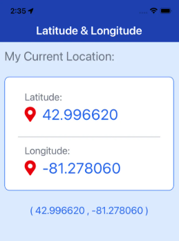
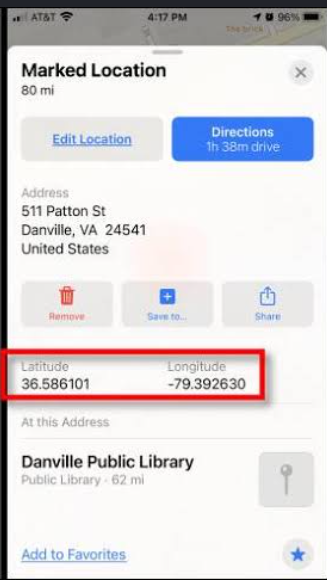

# S1_R6-AT3_PPDM
Objetivo da atividade
 - Esta é uma atividade que tem como objetivo, documentar a utilização e configuração do Expo Location.

 ## O Expo Location
  ### O que é?
 - É uma biblioteca da Expo que permite a leitura de informações de localização do dispositivo, ou seja, o usuário pode consultar a localização atual por meio desta biblioteca.

  ### Como instalar?
 - Antes da instalação da biblioteca é necessário verificar se o expo está instalado e pronto para uso, caso não esteja, no terminal, digite:
 - ```bash
    npm install -g expo-cli
    <!-- o '-g' significa que o expo será instalado globalmente -->
    ```

 - É possível instalar a biblioteca digitando o código abaixo no terminal
 - ```bash
    npx expo install expo-location
    <!-- instalando a biblioteca -->
   ```

  ### Como implantar no aplicativo?
 - Com a instalação concluída, para utilizar no desenvolvimento do aplicativo, é necessário que seja feita a importação da biblioteca.
 - Caso haja a necessidade de utilizar um emulador é preciso que antes seja certificado que a localização do mesmo esteja ativada e funcionando corretamente.
 - ```javascript
    import * as Location from 'expo-location'
    //importando a biblioteca do expo
    ```
 - Além da importação da biblioteca, é essencial a importação de outros componentes dos frameworks do Expo. Como:
 -  ```javascript
    import React, { useEffect, useState } from "react";
    import { StyleSheet, Text, View } from "react-native";
    import { SafeAreaView } from "react-native-safe-area-context";
    // importando componentes para a utilização
    ```
   #### Método de Latitude | Longitude:
 - Após a instalação e importação dos componentes, bilbiotecas e frameworks, o exemplo abaixo é uma forma comum de utilização da biblioteca, na qual podemos mostrar no programa, a latitude e longitude que o usuário se encontra.
 ```javascript
 export default function PosicaoGPSScreen() {
  const { location, setLocation } = useState(null);
  const { errorMsg, setErrorMsg } = useState(null);

  useEffect(() => {
    async function getCurrentLocation() {
      const { status } = await Location.requestForegroundPermissionsAsync();

      if (status !== 'granted') {
        setErrorMsg("Permissão negada")
        return;
      }
      const tempLocation = await Location.getCurrentPositionAsync();
      setLocation(tempLocation);
    }
    getCurrentLocation();

  }, []);

  let text = 'Aguardando...';
  if (errorMsg) {
    text = errorMsg;
  } else if (!errorMsg && location) {
    text = JSON.stringify(location);
  }

//retorna a função PosicaoGPSScreen
  return (
    <SafeAreaView style={styles.safeArea}>
      <View style={styles.container}>
        <View style={styles.header}>
          <Text style={styles.titleScreen}>Posição atual</Text>
          <Text style={styles.paragraph}>{text}</Text>
        </View>
      </View>
    </SafeAreaView>
  );
}
 ```

 

   #### Método de desmembramento Latitude | Longitude - Localização exata

   - Após a instalação e importação dos componentes, bilbiotecas e frameworks, o exemplo abaixo é uma forma mais completa de encontrar a localização do usuário. 
   - Em resumo, ela permite a visualização de localização do indivíduo de forma mais exata e completa.

   ```javascript 
   export default function PosicaoGPSScreen() {
  const [location, setLocation] = useState(null);
  const [localizacao, setLocalizacao] = useState(null);
  const [errorMsg, setErrorMsg] = useState(null);


  useEffect(() => {
    async function getCurrentLocation() {
      const { status } = await Location.requestForegroundPermissionsAsync();

      if (status !== 'granted') {
        setErrorMsg("Permissão negada")
        return;
      }
      const tempLocation = await Location.getCurrentPositionAsync();
      setLocation(tempLocation);

      const { latitude, longitude } = tempLocation.coords;

      const endereco = await Location.reverseGeocodeAsync({
        latitude,
        longitude
      })
      setLocalizacao(endereco[0])
      // Fazer mensagem de erro depois
    }
    getCurrentLocation();


  }, []);

  let text = 'Aguardando...';
  if (errorMsg) {
    text = errorMsg;
  } else if (!errorMsg && location) {
    text = JSON.stringify(location);
  }

  return (
    <SafeAreaView style={styles.safeArea}>
      <View style={styles.container}>
        <View style={styles.header}>
          <Text style={styles.titleScreen}>Posição atual</Text>
          {location ? (
            <View>
              <Text>Latitude</Text>
              <Text>{location.coords.latitude.toFixed(3)}</Text>

              <Text>Longitude</Text>
              <Text>{location.coords.longitude.toFixed(3)}</Text>

              <Text>Altitude</Text>
              <Text>{location.coords.altitude.toFixed(2)}</Text>

              {localizacao && (
                <View>
                  <Text>Rua</Text>
                  <Text>{localizacao.street}</Text>

                  <Text>Bairro</Text>
                  <Text>{localizacao.subdistrict}</Text>

                  <Text>Cidade</Text>
                  <Text>{localizacao.city}</Text>

                  <Text>CEP</Text>
                  <Text>{localizacao.postalCode}</Text>

                  <Text>País</Text>
                  <Text>{localizacao.country}</Text>
                </View>
              )}

            </View>
          ) : (
            <Text style={styles.paragraph}> Carregando Localização</Text>
          )}
        </View>
      </View>
    </SafeAreaView>
  );
}```

 

  ### Porquê utilizar o expo Location?
 - Ele é importante para a procura de localização em tempo real, ou seja, a biblioteca Expo Location permite a visualização em tempo real do usuário, estando sempre de acordo com o local onde o indíviduo se encontra, uma vez que, ao se movimentar, a biblioteca atualizará a localização atual.
 - Ademais, a biblioteca é multiplataforma, sendo ela disponível para iOS, web e Android.

  ### Conclusão
 - o Expo Location é uma biblioteca do Expo, que é de fácil instalação e manipulação, além de ter segurança garantida. Com ela, é possível manipular dados de localização do usuário indepentende de onde ele se encontrar.