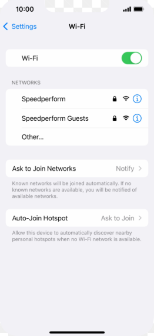

# S1_R6-AT3_PPDM
Objetivo da atividade
 - Esta é uma atividade que tem como objetivo, documentar a utilização e configuração do Expo Network.

## O Expo Network
  ### O que é?
 - É uma biblioteca da Expo que permite a leitura de informações de conexão wifi do dispositivo, ou seja, o usuário pode consultar a conexão wifi atual do dispositivo por meio desta biblioteca.

  ### Como instalar?
 - Antes da instalação da biblioteca é necessário verificar se o expo está instalado e pronto para uso, caso não esteja, no terminal, digite:
 - ```bash
    npm install -g expo-cli
    <!-- o '-g' significa que o expo será instalado globalmente -->
    ```

 - É possível instalar a biblioteca digitando o código abaixo no terminal
 - ```bash
    npx expo install expo-network
    <!-- instalando a biblioteca -->
   ```

  ### Como implantar no aplicativo?
 - Com a instalação concluída, para utilizar no desenvolvimento do aplicativo, é necessário que seja feita a importação da biblioteca.
 - Caso haja a necessidade de utilizar um emulador é preciso que antes seja certificado que a rede de conexão do mesmo esteja ativada e funcionando corretamente.
 - ```javascript
    import * as Network from 'expo-network';
    //importando a biblioteca do expo
    ```
 - Além da importação da biblioteca, é essencial a importação de outros componentes dos frameworks do Expo. Como:
 -  ```javascript
    import React, { useCallback, useEffect, useState } from "react";
    import { StyleSheet, Text, View, ActivityIndicator, ScrollView } from "react-native";
    import { SafeAreaView } from "react-native-safe-area-context";
    import * as Location from "expo-location"; // o expo location é importado para que o programa procure redes wifi presentes no local que o usuário se encontra.
    // importando componentes para a utilização
    ```
   #### Método de conexão:
 - Após a instalação e importação dos componentes, bilbiotecas e frameworks, o exemplo abaixo é uma forma comum de utilização da biblioteca, na qual podemos mostrar no programa, as conexões disponíveis e se o usuário está conectado em alguma delas.
 ```javascript
 export default function RedesWifiScreen() {
    const [info, setInfo] = useState(null);
    const [errorMsg, setErrorMsg] = useState(null);
    const [loading, setLoading] = useState(true);

    useEffect(() => {
        carregaRede();

        const subscription = Network.addNetworkStateListener(() => {
            carregaRede()
        });
        return () => subscription.remove();
    }, [])

    const carregaRede = useCallback(async () => {
        setLoading(true);
        setErrorMsg(null);
        try {
            const stateWifi = await Network.getNetworkStateAsync();

            let ip = 'Indisponível';
            let airplane = false;

            try {
                ip = await Network.getIpAddressAsync();
            } catch {
                ip = 'Indisponível';
            }
            try {
                airplane = await Network.isAirplaneModeEnabledAsync();
            } catch {
                airplane = false;
            }

            setInfo({
                type: stateWifi.type ?? Network.NetworkStateType.UNKNOWN,
                isConnected: stateWifi.isConnected ?? false,
                isInternetReachable: stateWifi.isInternetReachable ?? false,
                ipAdress: ip,
                isAirplaneMode: airplane
            })

        } catch (error) {

            setErrorMsg("Não foi possível obter as informações da rede de wifi.")

        } finally {
            setLoading(false)
        }
    }, [])

    const isWifi = info?.type === Network.NetworkStateType.WIFI
    const tipoLabel = info ? info.type ?? info.type : '-'

    return (
        <ScrollView style={styles.screen} contentContainerStyle={styles.content}>
            <Text style={styles.title}>Conexão de Rede</Text>
            <Text style={styles.subtitle}>Status da conexão ativa no celular</Text>
            {loading && !info ? (
                <View style={styles.loadingBox}>
                    <ActivityIndicator size='large' color='#25883E' />
                    <Text style={styles.loadingText}>Consultando a rede ...</Text>
                </View>
            ) : errorMsg ? (
                <View style={[styles.card, styles.errorCard]}>
                    <Text style={styles.errorText}>{errorMsg}</Text>
                </View>
            ) : (
                info && (
                    <View style={styles.card}>

                        <View style={styles.statusRow}>
                            <View style={[styles.statusDot, { backgroundColor: info.isConnected ? '#25883E' : '#B12727' }]}></View>
                            <Text style={styles.statusText}>
                                {info.isConnected ? 'Conectado' : 'Sem Conexão'}
                            </Text>
                        </View>

                        <View style={styles.divider}></View>
                        <InfoRow label="Tipo de conexão" value={tipoLabel} />
                        <InfoRow label="Rede Wifi" value={isWifi ? "Conectado via Wifi" : "Não conectado por Wi-fi"} />
                        <InfoRow label="Internet acessivel" value={info.isInternetReachable ? "SIM" : "Não"} />
                        <InfoRow label="Endereço IP" value={info.ipAdress} />
                        <InfoRow label="Modo Avião" value={info.isAirplaneMode ? "Ativado" : "Não"} />
                    </View>
                )
            )
        }
        </ScrollView>
    )
}
```

 - Para finalizar a configuração, foi utilizada uma função que tem como objetivos
    - Exibir uma linha horizontal com rótulo à esquerda e valor à direita.
    - Usado para cada linha de detalhe de rede (IP, tipo, modo avião...).
    ```javascript 
    function InfoRow({ label, value }) {
    return (
        <View style={styles.infoRow}>
            <Text style={styles.infoLabel}>{label}</Text>
            {/* numberOfLines={2}: permite quebra de linha, mas limita a no máximo 2 linhas */}
            <Text style={styles.infoValue} numberOfLines={2}>
                {value}
            </Text>
        </View>
    );
}```

 


  ### Por quê utilizar o expo Network?
 - Ele é importante pois fornece ornece acesso a informações essenciais sobre a rede do dispositivo, ou seja, a biblioteca Expo Network permite a visualização das conexões em tempo real do usuário, estando sempre de acordo com o local onde o indíviduo se encontra, uma vez que, ao se movimentar, a biblioteca atualizará a localização atual e consequentemente poderá mudar as redes de conexão disponíveis naquele momento.
 - Ademais, a biblioteca é multiplataforma, sendo ela disponível para iOS, tvOS, web e Android.

  ### Conclusão
 - o Expo Network é uma biblioteca do Expo, que é de fácil instalação e manipulação, além de ter segurança garantida. Com ela, é possível manipular dados de conexão do usuário independente de onde ele se encontrar.

# Referências utilizadas

- Documentação oficial Expo Network: 
<https://docs.expo.dev/versions/latest/sdk/network/>

- Documentações e instalação do Expo Network:
<https://www.npmjs.com/package/expo-network>